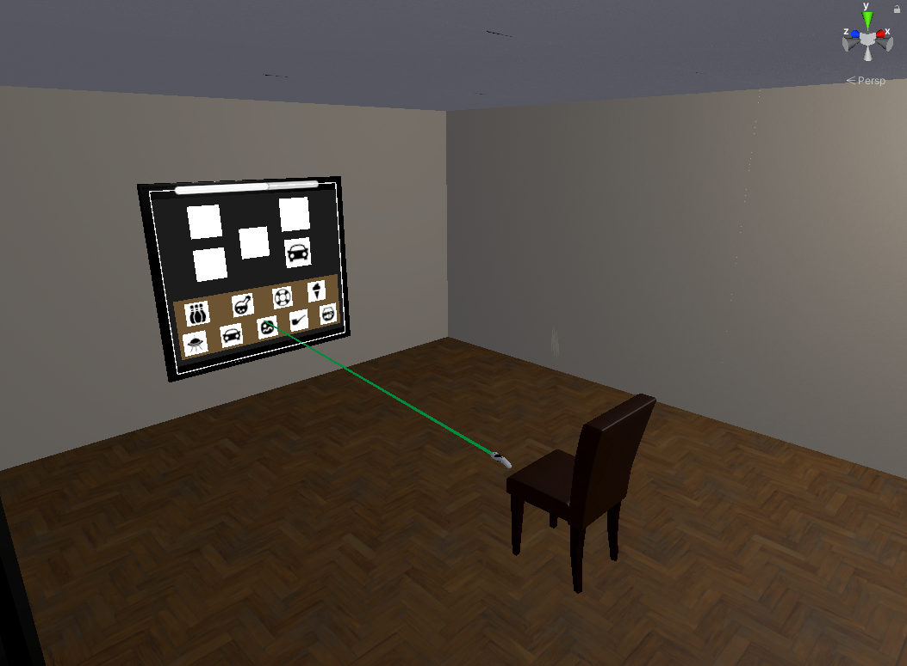

# Reasoning VR Game (FormFusion)
**Open-Source Reconstruction of a Cognitive Reasoning Task for Eye-Tracking–Based Cognitive Load Assessment**

<p align="center">
  
</p>

## Short Description
**Reasoning VR Game (Form Fusion)** is an open-source Unity3D reconstruction of the *FormFusion* reasoning task from the [Neuronation](https://www.neuronation.com/) cognitive training app, adapted for immersive virtual reality.    

The goal of this reconstruction is to provide a controlled, open-source, research-grade reasoning task suitable for cognitive science, HCI, and VR experimentation. This VR version was developed as part of a research study examining **intrinsic cognitive load** using **non-intrusive eye-tracking indicators**.   

This task involves selecting the correct shape that results from combining two or more given shapes. Users must mentally integrate geometric forms to determine which of the presented answer choices matches the composite image. The task grows more difficult as the combinations become more complex. The game consists of 26 levels, each with a time limit of 10 seconds, encouraging quick mental processing and decision-making. This task primarily engages logical reasoning by requiring mental transformation and integration of visual information

To isolate intrinsic load and minimize extraneous cognitive effort, the VR environment was intentionally designed to be minimalistic and distraction-free: a plain room, neutral lighting, and a virtual screen directly in front of the participant. Participants interacted using VR controllers, and all gameplay was preceded by gaze calibration and task familiarization.

<p align="center">
  
</p>

During gameplay, two main data streams were recorded in real time:

- **Eye-tracking metrics**:  
  Gaze origin, gaze direction, gaze validity, blink status, gaze hit point in 3D space, and the currently viewed virtual object.

- **Task performance metrics**:  
  Level number, task start and end time, duration, selected objects, and correctness.


## Tools & Technologies Used

This project was developed, tested, and deployed using the following hardware and software setup. These specifications are provided to support reproducibility and consistent VR performance across research environments.

## System Specifications (Development & Testing)

- **Windows 10 Pro 64-bit**  
- **AMD Ryzen 7 3700X**  
- **32 GB DDR4 RAM**
- **NVIDIA GeForce RTX 2080**
  
## Unity Development Environment
- **Unity Hub** :  Version Used: 3.10.0
- **Unity Editor** : Unity 2020.3.30f1 (LTS)  
 

## SDKs & VR Tools
- **Tobii XR SDK for Unity** - TobiiXRSDK_3.0.1.179
- **HTC VIVE Headset(Tobii Eye Tracking VR Retrofit Service)**
- **Brick Project Studio** - Apartment Kit
- **SteamVR 2.14.3**
- **Vive Console**
- **SRanipal Runtime**

## How to Run the Game

### 1. Install the following tools :
- Unity Hub , Unity Editor , SteamVR , Vive Console , SRanipal Runtime
### 2. Download **Tobii XR SDK for Unity** (version `3.0.1.179`)
### 3. Clone the Repository
```bash
git clone https://github.com/TugaAhmed/ReasoningGame_FormFusion.git
```
### 4. Add Tobii XR SDK to the Project
FormFusion/Packages/TobiiXRSDK_3.0.1.179
### 5. Open the Project in Unity Hub
- Open Unity Hub
- Click Add
- Select the cloned FormFusion project folder
- Open the project
- Accept the Tobii license agreement when prompted

### 6. Open the Main Scene
In the Unity Project window, navigate to:  
**Assets/Samples/Tobii XR SDK/3.0.1/formFusion_scene/formFusion_scene.unity**

### 7. Verify Required Unity Packages
From the Unity menu, open:
- **Window → Package Manager**
- Confirm that the following packages are installed:
  * XR Interaction Toolkit
  * XR Plug-in Management
  * OpenXR

### 8. Verify Project Settings
- Open: **Edit → Project Settings**
- Confirm the following:
  * XR Plug-in Management
  * OpenXR is enabled for PC / Standalone
  * OpenXR → Interaction Profiles
  * HTC Vive Controller Profile enabled
  * Oculus Touch Controller Profile enabled
-Ensure SteamVR is running in the background

### 9. Run the Game
- Connect the VR headset
- Launch SRanipal Runtime
- Press Play in Unity

## Data Logging
During gameplay, data are continuously recorded for **each level** and stored in **CSV format**.  
All data files are saved in:  **FormFusion/data**

## Collected Data Types

Two main categories of data are collected: **eye-tracking metrics** and **task performance data**.

### Eye-Tracking Data
The eye-tracking dataset includes the following fields:
- **Gaze Origin (3D position):**  
  The 3D position of the eyes in the virtual environment.

- **Gaze Direction (3D vector):**  
  The direction in which the eyes are pointing.

- **Gaze Validity:**  
  Indicates whether the recorded gaze data is considered reliable.

- **Blinking Status:**  
  Indicates whether the left or right eye is blinking.

- **Gaze Hit Point (3D):**  
  The specific point in the virtual environment where the gaze ray intersects.

- **Looked-at Object:**  
  The name of the virtual object currently being viewed.

- **Game Level:**  
  The level of the VR task during which the gaze data was recorded.


### Task Performance Data

The task performance dataset includes:

- **Game Level:**  
  The level number of the task being performed.

- **Start Time / End Time:**  
  Timestamps indicating when the level began and ended.

- **Duration:**  
  Total time taken by the participant to complete the level.

- **Accuracy:**  
  Indicates whether an empty position was filled correctly:
  - `yes` → correct
  - `no` → incorrect
  - `none` → not filled

- **Selection Times:**  
  The timestamp at which each empty position was filled during the level.

## Research Use & Citation

This project is an open-source VR reconstruction of a structured reasoning task, developed
and used for research on **intrinsic cognitive load assessment in immersive VR environments**
using eye-tracking data.

The game was used to collect synchronized eye-tracking and task performance data
for modeling cognitive load during reasoning-intensive VR tasks.

If you use this software, dataset, or any derived material in academic work,
**please cite both the repository and the associated publication**.

### Associated Paper
*(Add link when published)*  
> T. Yousif, *Eye-Tracking-Based Intrinsic Cognitive Load Assessment in Virtual Reality*.

### Dataset
A dataset containing eye-tracking and task performance data collected using this game
is available at:  
*(Add dataset link)*

### Citation (BibTeX)
```bibtex
@software{yousif_FormFusion_vr,
  author = {Yousif, Tuga},
  title = {FormFusion VR: A Reasoning-Based Cognitive Load Assessment Game},
  year = {2025},
  url = {https://github.com/your-repo},
}
```

## License

This project is released under the **MIT License**.

You are free to use, modify, and distribute this software for research and educational
purposes, provided that proper attribution is given.

> **Note:** This repository does not redistribute proprietary Unity Asset Store content.
Third-party assets (e.g., Brick Project Studio) are subject to their own licenses and must
be obtained separately by the user.

## Acknowledgements

This project was inspired by reasoning-based cognitive tasks commonly used in
digital cognitive training platforms, including the *FormFusion* task from **Neuronation**.
This implementation is an independent, open-source reconstruction designed
exclusively for research purposes.

The authors also acknowledge:
- **HTC VIVE** for the VR hardware ecosystem
- **Tobii** for XR eye-tracking tools and SDKs
- **Unity Technologies** for the game engine
- Contributors and participants who supported development and evaluation
